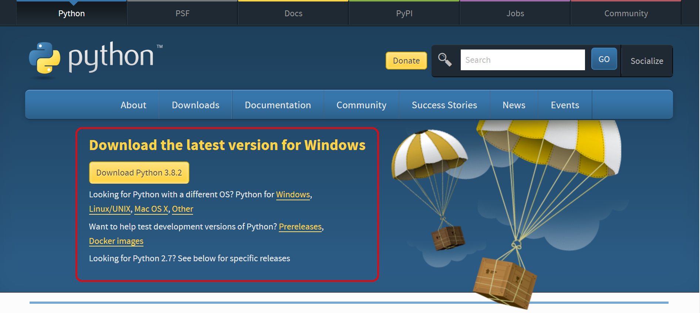
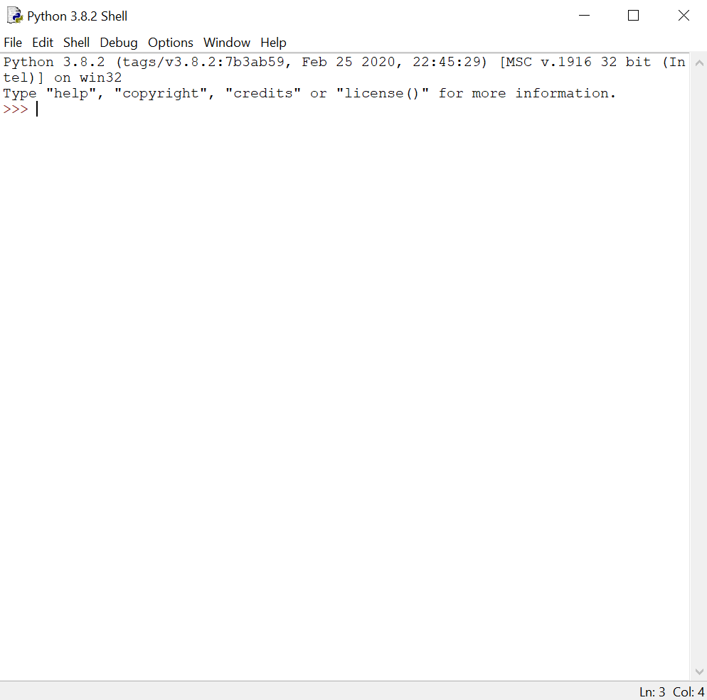
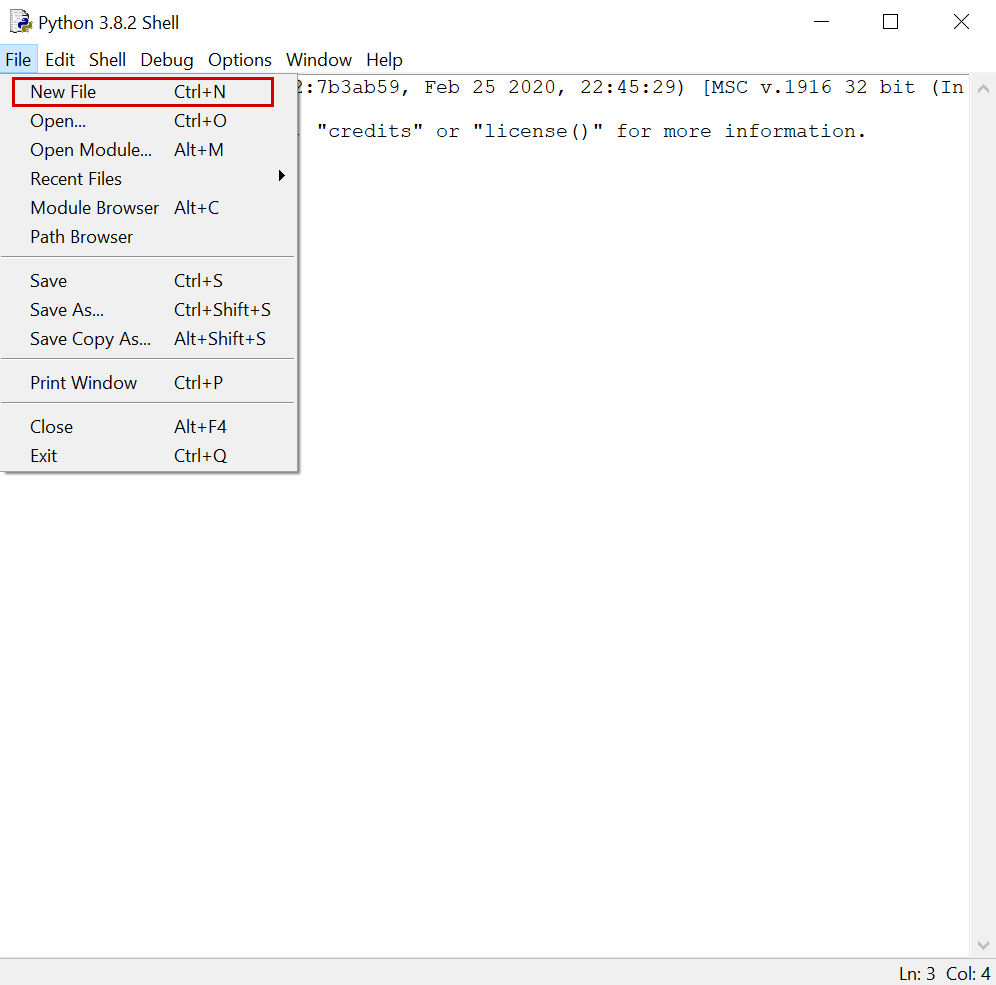
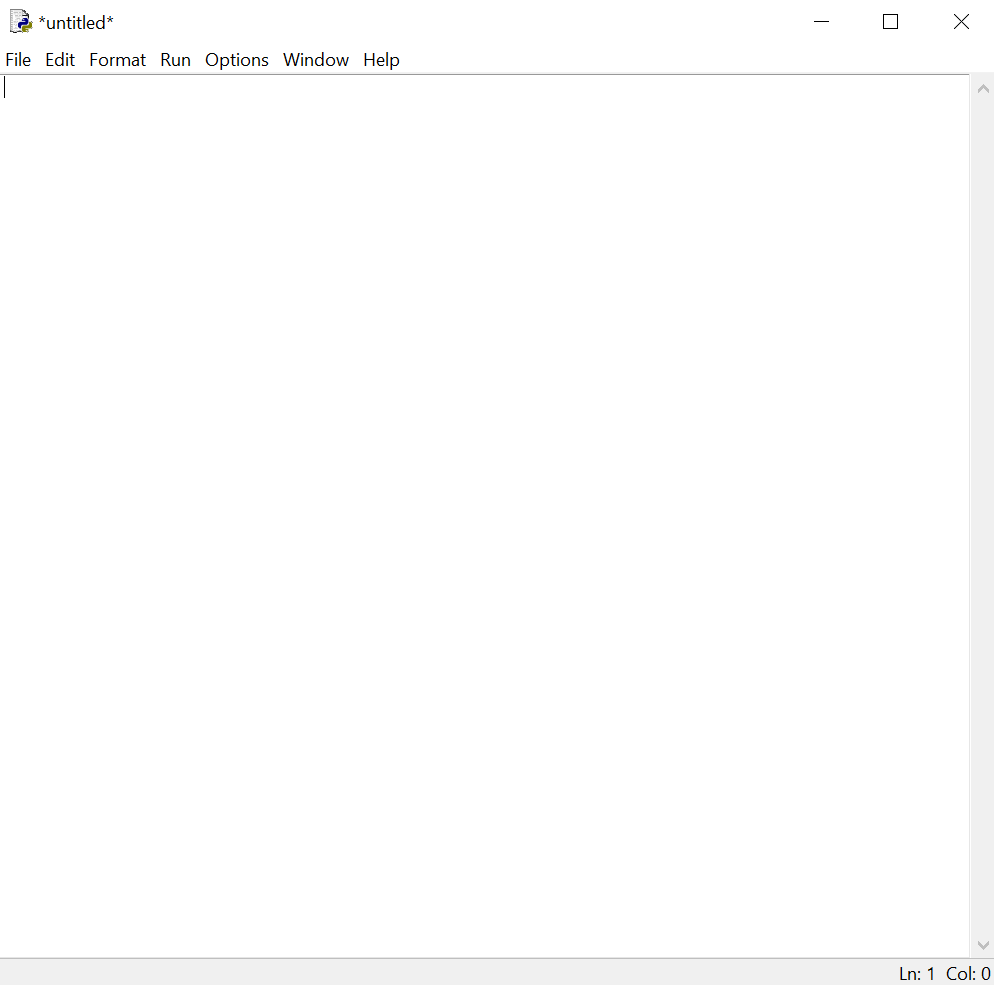
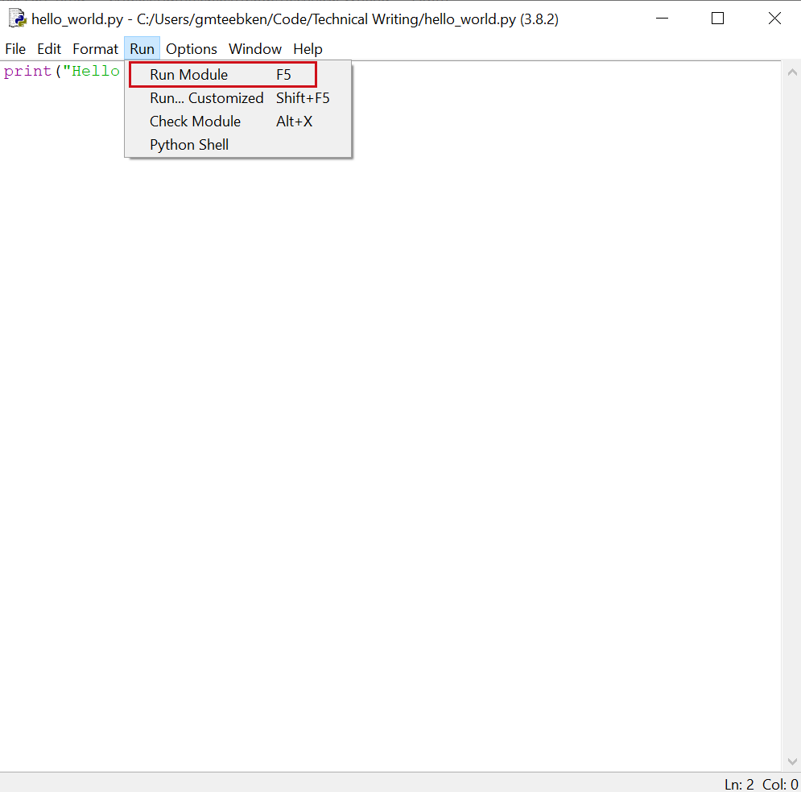
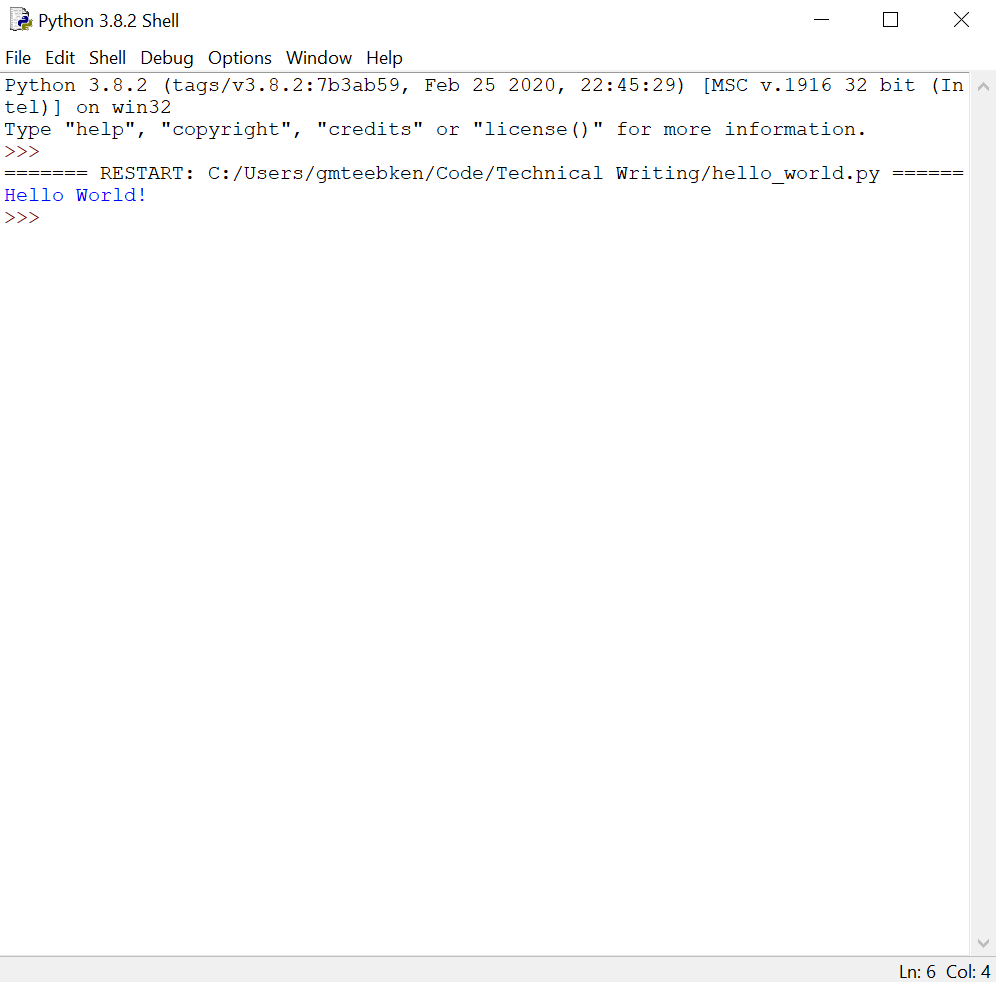

# Create Your First Python Program

When you hear the word "programmer", you might think of someone who lives in a dark basement and was born knowing how to code. However, that's not true at all. In fact, [more than half](https://jaxenter.com/impostor-syndrome-survey-149402.html "Study on Impostor Syndrome Among Tech Professionals") of professional programmers suffer from impostor syndrome. Every programmer starts somewhere and embarks on a lifelong learning process.

While some programming languages have a steep learning curve, Python is a language that allows you to start coding immediately. Its **syntax** (like grammar for coding) is clean and straightforward, and it is very user-friendly. Python removes a lot of the frustration from coding and allows you to create powerful programs.

This tutorial will walk you through installing Python, creating your very first code file, and running your Python code.

Let's begin!

### Install Python:

In order to begin, you'll  need to install Python on your computer. Thankfully, Python makes this simple for users on the most common operating systems (Windows, Mac, and Linux).

- Visit the [Python Downloads](https://www.python.org/downloads/ "The Python Downloads website") page.
> No need to figure out what to download; the website will automatically detect your operating system and suggest the proper download for you.



- Download and install Python (default settings are fine for now).
> If you encounter any difficulty, try [this installation guide](https://wiki.python.org/moin/BeginnersGuide/Download) or the [Python Help](https://www.python.org/about/help/) page.

### Run IDLE

Believe it or not, installing Python was probably the hardest part. Now, we need to write some Python. At this stage, writing Python is most easily accomplished by using the program IDLE, which installs along with Python on Windows and Mac systems (Linux users will have to install separately, see [this guide](https://www.poftut.com/download-install-and-use-python-idle-editor/) for help). IDLE allows you to write, save, and execute Python commands.

- Search for IDLE in your applications and open it.
> It will open something called a Python Shell, where you can directly execute lines of Python code.



- Go to the 'File' menu and click 'New File'.



- A new window called 'untitled' should pop up.
> This is where we'll write our code, save it as a file, and run it.



### Create Your Program

- Type the following line into the new window:

```python
print("Hello World!")
```
- Make a guess about what you think the previous line of code will do. Consider the following:
> - `Print` is a command that "prints out" whatever you put into it, rather like a real life printer.
> - The () contain whatever is supposed to be "printed out".
> - `"Hello World!"` is something called a **string**, which is exactly what it looks like: a bunch of letters and/or characters surrounded by quotation marks.

- Save your file in the folder you want to work in.
> Python requires you to save the file before running it. It's good style to name code files in one long string that starts with a letter and is separated by underscores. Some good file name examples:
>  - hello_world.py
>  - first_program.py

### Hello World!

- Run the code by clicking the 'Run' menu and then 'Run Module'.
> You can also use the keyboard shortcut `F5` to execute the program. If that doesn't work, try `Fn + F5` or `Ctrl + F5`.



- The Python Shell should pop up to greet you with the message `Hello World!`
> Think about your first guess: did your expectations match the results?



### Next Steps...

Now that you've created and run your first program, play around with the code. Don't be afraid to break it!
- Try removing the quotation marks around `"Hello World!"`.
- Try breaking up your one line of code into two lines.
- Try indenting your line of code.
- Try replacing `"Hello World!"` with your own phrase (don't forget the quotation marks).
- Try printing an **empty string**, or quotations with nothing inside of them: `print("")`
- Try writing a second line directly below the first one.

You'll notice that some of these variations cause errors and some of them do not. Think about what these errors might indicate about the **syntax** of Python. We'll cover what these errors mean, why they occur, and how to avoid them in a later tutorial.

For now, enjoy your status as a new Python programmer and keep practicing your first command!
